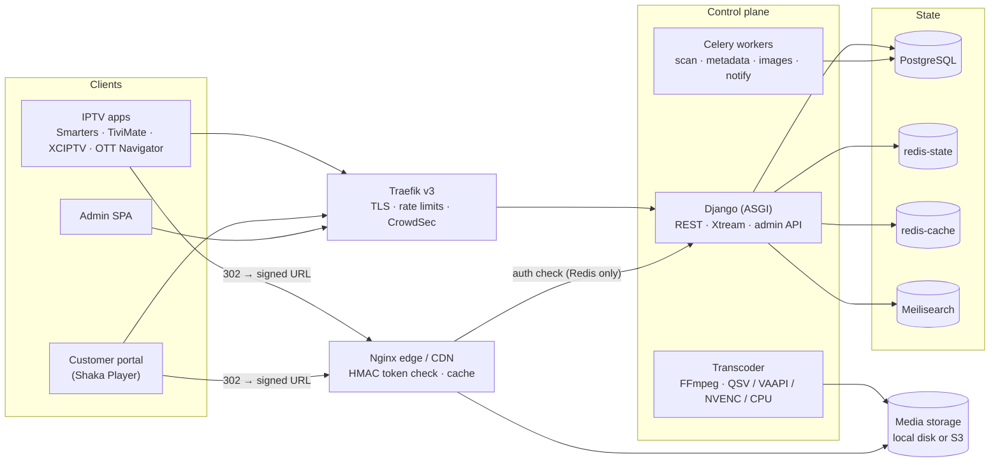

# Smart IPTV

**A self-hosted OTT/VOD subscription platform with an Xtream Codes-compatible API.** It brings library management like Plex/Jellyfin together with an IPTV panel. IPTV Smarters, TiviMate, XCIPTV, OTT Navigator and similar apps work with it out of the box.

> 🚧 **Status: the VOD platform is built and runs in production at tv.mah007.net. Live TV and monitoring are being built; security hardening and scale-out come after.**
> - **Working end to end:** an admin signs in with MFA and creates a customer, typing the IPTV username and password or generating them. Media is scanned, matched on TMDB (English and Arabic), transcoded and served by the signed-URL edge, and IPTV apps log in and play over the Xtream API. The contract suite and an automated IPTVnator journey prove it.
> - **Also done:** billing (plans, subscriptions, invoices, payments, emails); the HLS ladder with per-plan quality ceilings, 4K/HDR, subtitles and seek thumbnails; the complete admin panel; and the customer portal (browse, Arabic search, a Shaka-based player with resume, TV-app logins with QR codes, checkout).
> - **Being built now:** live TV with EPG and catch-up (M12), and monitoring with dashboards and alerts (M13).
> - **Still to come:** security hardening (M14), scale-out and CDN (M15), and testing on real TVs and phones (M10).
>
> See the [roadmap](#roadmap), [docs/PROGRESS.md](docs/PROGRESS.md) and the decisions in [docs/adr/](docs/adr/).

## Recent updates

Newest first; each step that lands on `main` adds a line here. Details in [docs/PROGRESS.md](docs/PROGRESS.md).

- **2026-10-04:** milestones M3, M4, M6, M7 and M9 tagged as accepted after a clean no-cache quality gate; movie playback also checked with FFmpeg through the signed edge.
- **2026-10-04:** live TV and EPG (M12) and monitoring (M13) started.
- **2026-10-04:** the admin panel is complete (M11): billing pages, collections, storage and title media panels, with 88 browser tests in both languages and themes. Deployed.
- **2026-10-04:** the customer portal is live (M11b): browse, Arabic search, the Shaka player with resume, account, TV-app logins with QR codes, checkout. Deployed.
- **2026-10-04:** full transcoding (M8): the HLS ladder with per-plan quality ceilings, 4K/HDR, subtitles (old Windows-encoded Arabic too) and seek thumbnails.
- **2026-10-04:** billing (M3) and the customer API (M6): plans, subscriptions, invoices, payments, emails; catalog, Arabic search, web playback.
- **2026-10-04:** live TMDB metadata on the server (English and Arabic titles).
- **2026-10-03:** proof of concept deployed: admin with MFA, customers with IPTV logins, scan, match, transcode, and IPTV apps playing.

> ⚖️ **For content you own or are licensed to distribute.** Smart IPTV has no torrent, Usenet, indexer or scraper features, and never will. Media enters only through folders or storage buckets that you manage. Every title carries rights-holder and licence fields, and titles hide automatically when their licence expires.

---

## Contents
- [How it works](#how-it-works)
- [Features](#features)
- [Architecture](#architecture)
- [Tech stack](#tech-stack)
- [System requirements](#system-requirements)
- [Quick start (development)](#quick-start-development)
- [Connecting an IPTV app](#connecting-an-iptv-app)
- [Deployment (production)](#deployment-production)
- [Roadmap](#roadmap)
- [Repository layout](#repository-layout)
- [Development workflow](#development-workflow)
- [Security](#security)
- [Attribution](#attribution)
- [License](#license)

---

## How it works

From a file on disk to a TV screen:

1. The admin drops `The.Matrix.1999.1080p.BluRay.x265.mkv` into the movies library.
2. Smart IPTV detects it and parses *The Matrix* / 1999 / 1080p / HEVC. It matches the file on TMDB and downloads the poster, backdrop, English and Arabic overview, cast, genres, rating and trailer.
3. It transcodes the title **once** into a set of formats that devices can play directly, then publishes it under *Movies → Science Fiction*.
4. The admin creates a customer with a plan (for example 2 connections until a chosen date). The credentials are shown once, with a QR code.
5. The customer enters the server URL, username and password in IPTV Smarters on their TV. Live TV, Movies and Series appear with artwork.
6. On **Play**, the server checks the subscription, expiry, device, connection count and category access. It then redirects the app to a short-lived signed media URL, and playback starts within about 2 seconds.
7. A third simultaneous stream is refused, or the oldest is kicked, depending on the plan. An admin's **Kill session** stops playback within 60 seconds.

## Features

✅ built and running · 🔨 being built now · 🔜 planned (see the [roadmap](#roadmap))

**Library and metadata**
- ✅ Folder watcher plus scheduled reconciliation scans that detect new, changed, moved and removed files.
- ✅ Filename parsing for movies, episodes, multi-episode files, anime absolute numbering and editions.
- ✅ TMDB matching with a confidence score: confident matches publish automatically, and doubtful ones go to a review queue.
- ✅ Metadata in English and Arabic, with posters in WebP/AVIF and blurhash placeholders. 🔜 TheTVDB as a fallback for TV.

**Media processing**
- ✅ **Transcode at ingest and direct-play at runtime.** Each title produces a compatible MP4 (H.264/AAC), an adaptive HLS ladder (1080p/720p/540p/360p) and an optional UHD variant.
- ✅ Hardware encoding with Intel QSV/VAAPI and NVIDIA NVENC, detected automatically, with CPU fallback.
- ✅ Subtitle extraction and sidecar `.srt` pickup, Arabic encoding fixes (cp1256 to UTF-8), and preview thumbnails for seeking.

**Streaming and anti-sharing**
- ✅ Separate control and streaming planes. Media servers only verify signed tokens and serve bytes; the database never sees a media request.
- ✅ Per-device credentials, server-side concurrency limits, device approval, IP and country rules, and new-device emails. 🔜 Per-user risk scoring.
- ✅ Live session view, with kill, block-device and block-IP actions.

**Xtream compatibility**
- ✅ `player_api.php`, `get.php` (M3U) and `/movie` and `/series` play URLs, with field types that exactly match the PHP panels apps expect. 🔨 Live channels: `/live` and `/timeshift` URLs, `xmltv.php` and the EPG actions.
- ✅ Contract tests on every response, plus an automated end-to-end run with IPTVnator.

**Admin and customer apps**
- ✅ Admin SPA in Arabic (RTL) and English, with dark and light themes, a ⌘K command palette, keyboard shortcuts and live dashboards.
- ✅ Customer web portal with a Shaka Player-based player, Continue Watching, search, recommendations, device and TV-app management, and checkout.

**Business**
- ✅ Plans, subscriptions, trials, a grace period and expiry reminders.
- ✅ Payments: manual, Stripe and Moyasar (mada, Apple Pay, STC Pay); the card providers switch on with their keys. 🔜 PayPal, HyperPay and Tap.
- ✅ Sequential invoices with VAT, as print-ready pages in Arabic and English (the browser saves them as PDF).
- ✅ Notifications by email, with admin-editable Arabic and English templates. 🔜 Telegram and WhatsApp.

**Operations**
- ✅ Prometheus metrics and credential redaction in every log. 🔨 Grafana dashboards, Loki logs and alerts to email and Telegram.
- ✅ An audit log of every admin action; sign-in rate limits and lockouts. 🔜 Backups with a restore drill, and CrowdSec.

## Architecture



- **The control plane decides.** Django, PostgreSQL, Redis and Celery handle accounts, catalog, entitlements and billing.
- **The streaming plane serves bytes.** Nginx edges verify an HMAC-signed token, check a 60-second-cached heartbeat in Redis, and stream from local disk or S3. Kicked or expired sessions get 403 on their next request.
- **Hosts:** `app.` (portal), `api.` (REST), `tv.` (Xtream), `admin.` (admin SPA) and `media.` (edge, small tier).

## Tech stack

| Layer | Choice |
|---|---|
| Backend | Python, Django + Django REST Framework, Celery, Gunicorn/Uvicorn (ASGI) |
| Data | PostgreSQL, two Redis/Valkey instances (state and cache), Meilisearch |
| Media | FFmpeg (jellyfin-ffmpeg build), ffprobe, guessit, rapidfuzz, ffsubsync |
| Frontend | React, TypeScript (strict), Vite, TanStack Router/Query/Table, Tailwind CSS, shadcn/ui, i18next |
| Player | Shaka Player (hls.js fallback) |
| Edge and ingress | Nginx with njs, Traefik v3 |
| Observability | Prometheus, Grafana, Loki, Grafana Alloy |
| Tooling | uv, Ruff, mypy, pytest, pnpm, Vitest, Playwright, Locust, k6 |
| Quality gate | `make ci`, run locally (no hosted CI): lint, types, tests, image build, Trivy, licence gate; pip-audit, pnpm audit and Semgrep join in M14 |

**Pinned today:** Python 3.13, Django 5.2 LTS, Celery 5.6, PostgreSQL 18, Valkey 9.1, Meilisearch 1.54, Traefik 3.7, Node.js 24 LTS, pnpm 12, React 19, Vite 8, Tailwind CSS 4, TypeScript 6.0. [ADR-0001](docs/adr/0001-stack-and-versions.md) lists every version, the date it was checked, and the reason for each deviation from the original spec.

Every dependency imported into our code is permissively licensed (MIT, BSD, Apache-2.0, ISC, MPL-2.0, or LGPL used unmodified), and the licence gate in `make ci` enforces this. GPL/AGPL tools run only as separate processes.

## System requirements

### Software
| Need | Details |
|---|---|
| Operating system | Linux x86_64 is recommended for production. For development, Linux or Windows with Docker Desktop and WSL2. |
| Docker | Docker Engine with the Compose v2 plugin. |
| Basics | `git`, `make`, `curl`, `openssl` and `python3` (curl for `make smoke`, openssl for the secrets script, python3 for the licence gate). Everything else runs in containers. |
| Contributors (optional) | For editor tooling outside containers: [uv](https://docs.astral.sh/uv/) (installs Python 3.13) and Node.js 24 LTS with corepack (pnpm 12). |
| GPU (optional) | Intel iGPU/Arc (QSV/VAAPI via `/dev/dri`) or an NVIDIA GPU with the NVIDIA Container Toolkit. Without a GPU, transcoding falls back to CPU. |

### Network
- Ports **80** and **443** free on the host, for Traefik. In development, `make secrets` switches to port **8080** automatically if 80 is taken.
- DNS records for `app.`, `api.`, `tv.`, `admin.`, `media.` (small tier) and `grafana.` under your domain. Development uses `*.localhost` with no DNS needed.
- Outbound HTTPS to TMDB, plus any of TheTVDB, SMTP, payment providers, Telegram and WhatsApp that you enable.

### Accounts and keys
- **TMDB API key.** Commercial use needs a TMDB commercial licence. Without a key, development runs on recorded fixtures.
- **TheTVDB** (optional, for TV ordering). Its paid tier is required above $50k revenue.
- Payment provider, SMTP, Telegram bot and WhatsApp Business accounts, as needed.

### Hardware sizing
These are starting points, not benchmarks. The M15 load-test report will replace them with measured figures.

| Setup | CPU | RAM | Disk |
|---|---|---|---|
| Development laptop | 4+ cores | 8 GB (16 GB with the monitoring overlay) | 40 GB free, plus sample media |
| Small production (single host) | 8+ cores, iGPU or NVIDIA GPU recommended | 16–32 GB | NVMe for database and transcode scratch, plus library storage (below) |

**Storage.** Plan for the source file plus about **7–9 GB per hour of 1080p content** for renditions. That is the HLS ladder at about 5.4 GB per hour plus the compatible MP4. The UHD variant adds about 7.5 GB per hour when enabled.

**Bandwidth.** This is usually the real limit. A 1080p stream uses about **6–8.5 Mbps**, so **100 concurrent viewers need about 0.6–0.85 Gbps** of egress. Keep at least 30% headroom at peak. For larger audiences, use the CDN tier.

## Quick start (development)

```bash
git clone https://github.com/mah007/iptv.git smart-iptv && cd smart-iptv
make secrets   # create a git-ignored .env with generated secrets (picks port 8080 if 80 is busy)
make up        # build, start everything with hot reload, wait for healthchecks, run migrations
make smoke     # check routing, isolation and readiness through Traefik
```

`make up` prints the URLs. With the default port 80 they are:

| URL | What |
|---|---|
| http://admin.localhost | Admin SPA (Arabic/English, light/dark) |
| http://app.localhost | Customer portal |
| http://api.localhost/api/v1/ | Customer REST API for apps (bearer tokens) |
| http://tv.localhost/player_api.php | Xtream API for IPTV apps |
| http://media.localhost/healthz | Media edge: artwork and signed playback URLs |
| http://mail.localhost | Mailpit: emails the stack sends in development |
| http://traefik.localhost | Traefik dashboard (development only) |

On port 8080, add `:8080` to each URL. Modern browsers and curl resolve `*.localhost` to your machine, so no hosts-file edits are needed.

| Command | What it does |
|---|---|
| `make` | List every command |
| `make test` | pytest (against the running stack's real Postgres, Valkey and Meilisearch) and Vitest |
| `make test-backend t="apps/core/tests/test_routing.py -k internal"` | Run selected backend tests |
| `make lint` · `make fmt` · `make typecheck` | Ruff, ESLint and Prettier · auto-format · mypy and tsc |
| `make logs s=web` · `make ps` · `make shell` | Follow one service's logs · status · Django shell |
| `make build` · `make smoke-images` · `make scan` · `make licenses` | Production images · start and health-check them · Trivy CVE and secret scan · licence gate on their dependencies |
| `make ci` | The full quality gate on the committed tree; run it before pushing (there's no hosted CI) |
| `make down` | Stop the stack; data volumes are kept |

Demo data and media:

| Command | What it does |
|---|---|
| `make seed args=--reset-admin-password` | Roles, the owner admin `admin` (password printed once; MFA enrolment at first sign-in), demo customers, plans and subscriptions |
| `make sample-media` | Legal synthetic sample files (FFmpeg test patterns named like real titles) in `./media` |
| `make media-ready` | Adds the sample libraries if missing, then waits until a movie and a series are scanned, matched and transcoded |
| `make compat` · `make compat-live` · `make e2e-iptvnator` | Xtream contract suite: offline, against the running stack, and an IPTVnator journey that signs in and plays |
| `make e2e-admin` | Admin journeys in Playwright with the host's Chrome (MFA sign-in, create a customer, reset a device, scan, resolve a review, stop a session) and axe on every page in English/light and Arabic/dark, plus a 390 px check; needs `make media-ready`. Report in `dist/admin-e2e` |
| `make e2e-portal` | Portal journey in Playwright (sign in, Arabic search, play The Matrix, continue watching, sign out) and axe on ten pages in Arabic/light and English/dark at 390 px. Report in `dist/portal-e2e` |

## Connecting an IPTV app

> Works today. The verified client matrix and illustrated guides in Arabic and English arrive in **M10**.

1. In the admin, go to **Customers → Create customer**. Set the access period (or a plan), then add the first device. **Type the username and password you want, or let them be generated.** The password is shown **once**, with a QR code.
   - Usernames: 3–32 letters, digits, `.`, `_` or `-`.
   - Passwords: at least 8 characters of letters, digits and `. _ - ~ @ ! *`.

   These are the characters every IPTV app can put in a URL.
2. In the app, choose **Xtream Codes API** login and enter:
   - **Server:** `https://tv.example.com`
   - **Username / Password:** from step 1
3. Apps that only accept a playlist can use the M3U URL:
   `https://tv.example.com/get.php?username=USER&password=PASS&type=m3u_plus&output=ts`

Each TV or app should get its own device credential, so one can be revoked without affecting the others. Customers can add apps themselves from **Account → Devices & TV apps**.

Supported apps include IPTV Smarters, TiviMate, XCIPTV, OTT Navigator, IBO Player, SmartOne and UHF (Apple TV).

> ⚠️ MAC-activated apps store credentials on their vendor's servers.

## Deployment (production)

> **The small tier works today.** One host runs everything behind Traefik with Let's Encrypt TLS and HSTS: `docker/compose.yml` plus `docker/compose.prod.yml`. Follow the runbook [docs/runbooks/deploy.md](docs/runbooks/deploy.md): `git pull`, `scripts/secrets.sh`, `up -d --build --wait`. Migrations run automatically before the app starts, and `manage.py create_owner` creates the first admin. Zero-downtime `make deploy`, monitoring, backups and the medium/large tiers below arrive in **M13–M15**.

### Tiers
| Tier | Layout |
|---|---|
| **Small** | One host runs everything. Traefik routes `media.` to the built-in Nginx edge. |
| **Medium / Large** | Standalone edge servers (own TLS, or behind a CDN with token auth), an S3-compatible origin (SeaweedFS, Cloudflare R2, Backblaze B2) with sliced range caching, and a PostgreSQL replica. |

### Steps
1. **DNS.** Point `app.`, `api.`, `tv.`, `admin.`, `media.` and `grafana.` at the server.
2. **Server.** Install Docker. For NVIDIA transcoding, also install the NVIDIA Container Toolkit; Intel needs `/dev/dri` available.
3. **Secrets.** Use Docker secrets or a SOPS-encrypted `.env.prod`. Only `.env.example` is ever committed.
4. **TLS.** Traefik obtains Let's Encrypt certificates (TLS or DNS challenge). HSTS is on, and every redirect stays https→https.
5. **Deploy.** `make deploy` builds and pushes images, pulls them on the server, runs migrations as a one-off job, and then rolls two health-gated `web` replicas for zero downtime.
6. **Monitoring.** Enable `compose.monitoring.yml`. Grafana sits behind admin auth, and alerts go to email and Telegram.
7. **Backups.**
   - Nightly `pg_dump` plus WAL archiving, encrypted to object storage.
   - Media is backed up with restic. Renditions are excluded because they can be regenerated.
   - `make restore-test` proves a restore works and should run weekly.

### CDN
- Bunny CDN pull zones with token authentication are supported and documented in a runbook.
- **Don't** put video behind Cloudflare's free or pro CDN, because its terms forbid it.
- Never load-test against a CDN or public egress.

### Go-live checklist
- [ ] TMDB commercial licence signed (and a TheTVDB tier if needed); TMDB attribution visible.
- [ ] Every title has rights metadata, and the licence-expiry job is active.
- [ ] TLS rated A+, HSTS on, admin MFA enforced, no default credentials.
- [ ] Secrets only in Docker secrets or SOPS; an automated test proves none appear in images or logs.
- [ ] Nightly DB backups with WAL, and a restore drill passed within the last 7 days.
- [ ] Alerts verified with a fire drill.
- [ ] Load test meets targets, with at least 30% bandwidth headroom at peak.
- [ ] Client app matrix passed on real devices.
- [ ] Runbooks written for deploy, rollback, key rotation, DB restore, adding an edge, rebuilding the search index, a leaked credential, and incident response.
- [ ] Privacy policy and terms published in Arabic and English, with data-retention jobs active.
- [ ] Rate limits and CrowdSec active, OWASP ZAP baseline clean, dependency scans clean.

## Roadmap

Each milestone ends with a checkpoint: what was built, how to verify it, and an acceptance checklist. A milestone is tagged `m{N}-done` once every criterion passes.

| # | Milestone | Delivers | Status |
|---|---|---|---|
| M1 | Infrastructure & repo | Monorepo; `make up` boots the full stack; `make ci` quality gate green (lint, types, tests, build, Trivy, licence gate); versions pinned in ADR-0001 | ✅ Done |
| M2 | Backend foundation | Redacted structured logs, problem+json errors, OpenAPI and the generated client, settings registry, feature flags, audit log, metrics | ✅ Done |
| M3 | Accounts & subscriptions | Users, roles, devices, Xtream credentials (Argon2id, admin-chosen or generated), admin MFA, plans, subscription activation, expiry and grace jobs, entitlement cache, invoices, payments, notifications | ✅ Done |
| M4 | Library scanner | Watcher, reconciliation scans, move detection, ffprobe, filename parsing, live scan progress, sample media | ✅ Done |
| M5 | Metadata | TMDB client, match scoring, review queue, English and Arabic enrichment, image pipeline (TheTVDB fallback still to come) | ✅ Mostly done |
| M6 | Catalog & search | Catalog API, categories, collections, Meilisearch with Arabic normalisation, home rows | ✅ Done |
| M7 | Direct-play streaming | Nginx edge with signed tokens, playback API, concurrency limits, kick, session sweeper | ✅ Done |
| M8 | Transcoding | Rendition planner, GPU detection, compatible MP4, HLS ladder with per-plan ceilings, UHD/HDR, thumbnails, subtitles, retention | ✅ Done (GPU benchmarks pending) |
| M9 | Xtream API | All VOD and series endpoints with exact types, per-plan cache, M3U, contract tests, IPTVnator E2E | ✅ Done |
| M10 | Client compatibility | Verified on Smarters, TiviMate, XCIPTV, OTT Navigator, UHF and a webOS/Tizen app; Arabic and English setup guides | Needs real devices |
| M11 | Admin UI | Every admin page, both themes, Arabic RTL and English, shortcuts, live views, accessibility checks | ✅ Done |
| M11b | Customer portal | Browse, search, player with thumbnails, tracks and resume, checkout (manual, Stripe, Moyasar) | ✅ Done (provider sandboxes need keys) |
| M12 | Live TV & EPG | Channels and groups, XMLTV EPG, live HLS/TS, catch-up | 🔨 In progress |
| M13 | Monitoring & logging | Dashboards, alerts, Loki with verified redaction | 🔨 In progress |
| M14 | Security hardening | Rate limits, CrowdSec, CSP, re-authentication, key rotation, backup and restore drill, ZAP baseline, STRIDE threat model | Partly (rate limits, lockouts) |
| M15 | Scale & CDN | Standalone edges, S3 origin, Bunny CDN token auth, Postgres replica, load-test report at 1,000+ virtual users | Planned |
| Later | Beyond v1 | Native TV apps, pluggable ML recommender | Ideas |

## Repository layout

```
backend/     Django apps: accounts, billing, catalog, library, metadata, media,
             playback, xtream_api, live, engagement, search, notifications, audit, dashboard
frontend/    pnpm workspace: packages/ui (design system), packages/api (generated client),
             apps/admin, apps/portal
streaming/   Nginx edge config, njs token verification, FFmpeg rendition profiles
docker/      Dockerfiles and compose files (base, dev, prod, GPU, monitoring), Traefik config
monitoring/  Prometheus rules, Grafana dashboards, Loki and Alloy config
compat/      Xtream JSON schemas, golden fixtures, client checklist
loadtests/   Locust and k6 scenarios
scripts/     secrets, sample media, backup/restore, key rotation
docs/        PROGRESS.md, ADRs (docs/adr/), runbooks, client setup guides (ar/en)
```

## Development workflow

- Work happens milestone by milestone: plan, record decisions as ADRs (`docs/adr/`), build in small verified steps, then stop at a checkpoint. Status lives in [docs/PROGRESS.md](docs/PROGRESS.md).
- Commits follow [Conventional Commits](https://www.conventionalcommits.org/), for example `feat(playback): …` or `fix(xtream): …`.
- There's no hosted CI ([ADR-0003](docs/adr/0003-no-hosted-ci.md)). `make ci` is the quality gate. It runs:
  - the stack and smoke test;
  - lint (with a missing-migrations check) and types;
  - the Xtream contract suite;
  - tests;
  - sample media scanned and transcoded, live Xtream contract checks, and the IPTVnator journey;
  - production images, started and health-checked with `check --deploy`;
  - a Trivy CVE and secret scan, and the licence gate.

  It checks the committed tree, so commit first (or pass `ALLOW_DIRTY=1`), and run it before pushing.
- The frontend lint blocks hard-coded user-facing text (use i18next) and physical left/right Tailwind classes (use logical ones so Arabic mirrors).
- `make api-client` regenerates the typed frontend clients (`packages/api` for the admin, `packages/api-portal` for the portal) after API changes, and `make ci` fails if they're out of date.
- [CLAUDE.md](CLAUDE.md) holds the architecture rules and conventions for AI-assisted development with Claude Code.

## Security

- Per-device Xtream credentials hashed with Argon2id. Failed logins look identical whether the user or the password was wrong.
- Short-lived HMAC-signed media URLs with key rotation, and optional IP binding.
- Server-side concurrency limits, with sessions killable within 60 seconds.
- Admin MFA (TOTP and WebAuthn), re-authentication for sensitive actions, and an idle timeout.
- Rate limiting at Traefik and in Django, CrowdSec, a strict CSP and an append-only audit log.
- Credentials and tokens are redacted in every log pipeline (Traefik, Nginx, Django, Alloy), and a test enforces it.

Please report vulnerabilities privately to the maintainer via [mah007.net](https://mah007.net), not in a public issue.

## Attribution

- This product uses the TMDB API but is not endorsed or certified by TMDB.
- IP geolocation by [DB-IP](https://db-ip.com) (DB-IP Lite, CC BY 4.0).

## License

Proprietary. All rights reserved.

---

<p align="center">Made with ❤️ for the streamers community by <strong>Mahmoud AbdelLatif</strong> · <a href="https://mah007.net">mah007.net</a></p>
