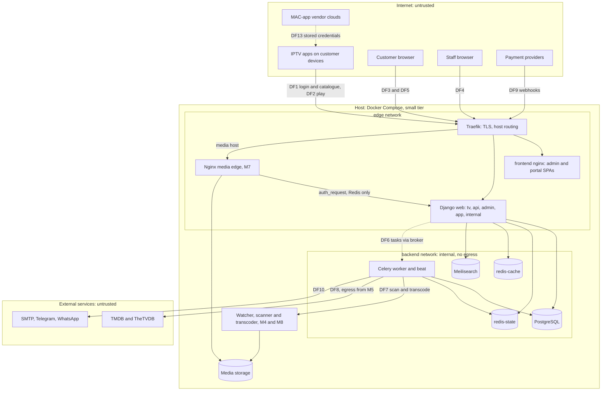

# Threat model (STRIDE)

| | |
|---|---|
| **Version** | 1, draft, 3 October 2026 |
| **Covers** | The system as the spec describes it (all milestones), compared with what is built: commit `eb35c68` (M1 plus the single-host production overlay) and the M2/M3 slice that was in the working tree on that date |
| **Method** | STRIDE per element on a level-1 data-flow diagram, with qualitative likelihood and impact |
| **Review** | At every milestone checkpoint. A reviewed version is part of M14 acceptance (spec §16) |
| **Handling** | This file lists weaknesses that are still open. The repository is public ([PROGRESS](../PROGRESS.md) explains why the spec is kept out of git), so the owner should decide whether to publish this file before the M14 fixes land |

## Contents

1. [Summary: highest risks](#1-summary-highest-risks)
2. [Scope and assumptions](#2-scope-and-assumptions)
3. [How to read this document](#3-how-to-read-this-document)
4. [System and data flows](#4-system-and-data-flows)
5. [Assets](#5-assets)
6. [Threat actors](#6-threat-actors)
7. [Trust boundaries](#7-trust-boundaries)
8. [STRIDE analysis per element](#8-stride-analysis-per-element)
9. [Abuse cases: credential sharing and reselling](#9-abuse-cases-credential-sharing-and-reselling)
10. [Gaps and recommendations by milestone](#10-gaps-and-recommendations-by-milestone)
11. [Maintenance](#11-maintenance)

## 1. Summary: highest risks

1. **Revocation can lag.** A revoked, reset or blocked Xtream credential can keep working from the 5-minute auth cache, whose key is derived from the plaintext the server no longer has, and its running streams continue until their tokens expire (G-02).
2. **One slot can serve two households.** The session identity `sha256(user, device, title)` merges two clients watching the same title on one credential into one session and one concurrency slot. With live channels (M12), that lets one credential feed many viewers of the same match (G-13).
3. **The edge must bind tokens to what they unlock.** Stream-auth must require an existing session, and the edge must check the requested title and rendition against the token, or a leaked key or a cheap token unlocks everything (G-14, G-15).
4. **Client IP trust.** Lockouts, the audit trail, IP rules and anti-sharing scores all depend on the client IP; it must come only from the trusted proxy (G-04).
5. **Traefik holds the Docker socket.** The `:ro` mount protects only the socket file, not the Docker API, so a Traefik compromise means root on the host (G-36).
6. **Passwords in messages.** The spec's welcome notification includes a QR code; if it encodes the password as the admin screen does, plaintext passwords end up in the outbox table and in mailboxes (G-28).
7. **No backups yet.** The deploy runbook says nothing on the server is backed up until M14 (G-41).
8. **Anti-sharing scoring has no milestone.** Spec §11.1 risk scoring is not in any milestone row of spec §16 (G-27).
9. **Licensors and DRM.** Xtream apps can't play DRM-protected streams, so every licence must accept non-DRM delivery (G-45).

## 2. Scope and assumptions

**In scope:** everything the spec describes:

- the control plane: Django web, Celery worker and beat, watcher, scanner, transcoder;
- the streaming plane: Nginx edges, later a CDN;
- state: PostgreSQL, redis-state, redis-cache, Meilisearch;
- media storage;
- ingress through Traefik;
- the admin SPA, the customer portal and the Xtream API used by third-party apps;
- external integrations: metadata providers, payment providers and notification channels.

**Deployment:** the small tier from the [deploy runbook](../runbooks/deploy.md): one Linux host with Docker Compose, Traefik with Let's Encrypt, the Xtream host on the base name (`tv.example.com`) and the other hosts as its subdomains. The medium and large tiers (standalone edges, S3 origin, CDN, database replica; M15) are covered where they change the picture.

**Owner decision of 3 October 2026** (`docs/plans/m2-m3.md`): proof of concept first. Plans, subscriptions, payments, invoices, trials and notifications move to a final commercial slice. Until then a per-customer access profile (expiry, stream and device limits, quality ceiling, allowed types and categories) feeds the entitlement. This document keeps the spec's milestone numbers and marks moved items **commercial slice**.

**Out of scope:** the internals of third-party IPTV apps and of MAC-app vendor clouds (both treated as untrusted external entities), physical security of the host, volumetric DDoS beyond what the host and a CDN absorb, and content licensing itself (but see AC-7 for the licensor-facing risk).

**Assumptions:**

- **A1.** Staff devices are reasonably maintained, and every staff member uses MFA.
- **A2.** Customer devices and apps are untrusted. Any credential handed to a customer can leak (spec §1, rule 6).
- **A3.** Licensors accept non-DRM delivery for the catalogue. This must be confirmed per licence (AC-7, G-45).
- **A4.** The operator runs `make ci` before deploying ([ADR-0003](../adr/0003-no-hosted-ci.md)) and keeps `.env` only on the server.

## 3. How to read this document

**Status tags** on every mitigation:

| Tag | Meaning |
|---|---|
| **Built** | Committed and passing `make ci`: M1 and the production overlay |
| **In progress** | In the M2 working tree on 3 October 2026, not yet committed |
| **M3 slice** | Approved for the current slice (M3-lite), not built yet |
| **Planned Mx** | Specified for milestone Mx, not built |
| **G-nn** | A gap: not covered by the spec as written, or covered but needing a specific design decision. See [section 10](#10-gaps-and-recommendations-by-milestone) |

**Ratings** (L = likelihood, I = impact):

| | High (H) | Medium (M) | Low (L) |
|---|---|---|---|
| **Likelihood** | Commodity attack, or routinely seen against IPTV services | Needs skill, an insider position or a specific condition | Needs several unlikely conditions together |
| **Impact** | Many customers' credentials or the licensed catalogue exposed; host compromise; licensor, legal or major financial exposure | One account or one component affected; a short outage | A nuisance or a minor information leak |

## 4. System and data flows

`web` sits on both networks; the data stores sit only on `backend`, which has no route from Traefik and no internet egress ([ADR-0002](../adr/0002-foundations-identity-routing-networks.md)).

| ID | Flow | Path | Sensitive content |
|---|---|---|---|
| DF1 | Xtream login and catalogue | IPTV app → Traefik (`tv.`) → web (`xtream_api`) → redis-state (auth cache, `ent:{user}`), PostgreSQL (credential on a cache miss), redis-cache (catalogue JSON) | Username and password in the query or form body |
| DF2 | Xtream play | App → `tv./movie/{u}/{p}/{id}.mp4` → web checks credential, entitlement and slot, creates the session and mints a token → `302` to `media./v/{token}/{id}.mp4` → Traefik (small tier) → Nginx edge checks the HMAC → `auth_request` to web `/internal/stream-auth` (Redis only) → storage | Credentials in the URL path; a bearer token in the URL path; media bytes |
| DF3 | Portal playback | Browser → `app./api/v1/playback/start` → signed HLS URL → edge | Session cookie; token |
| DF4 | Administration | Staff browser → `admin.` (SPA from frontend nginx; `/api` to web with a session cookie, CSRF and MFA) → PostgreSQL and Redis; live feeds over SSE | Staff credentials, TOTP codes, customer data, one-time Xtream passwords |
| DF5 | Customer account | Browser → `app./api` → web; *Add TV app* mints a device credential | Customer credentials, personal data, one-time Xtream passwords |
| DF6 | Background jobs | Beat → broker (redis-state) → worker → PostgreSQL and Redis | Task arguments |
| DF7 | Ingest | Admin-managed library folders or buckets → watcher and scanner (ffprobe, guessit) → transcoder (FFmpeg) → storage; rows to PostgreSQL | Untrusted media files |
| DF8 | Metadata | Worker → TMDB and TheTVDB → image pipeline → storage → edge or CDN | API keys; untrusted JSON and images |
| DF9 | Payments (commercial slice) | Browser → provider's hosted checkout; provider webhook → `api./api/v1/webhooks/{provider}` → `subscriptions.activate` | Signed events and amounts |
| DF10 | Notifications (commercial slice) | Outbox → worker → SMTP, Telegram, WhatsApp | Contact data and message content |
| DF11 | Telemetry | Logs on stderr → Docker json-file (Alloy and Loki from M13); `/metrics` (internal) → Prometheus → Grafana | Request metadata, redacted |
| DF12 | Operations | Operator → SSH → host: `git pull`, `docker compose`, `.env`; Traefik ↔ Let's Encrypt | Secrets, images |
| DF13 | MAC-app provisioning | Customer → vendor website (IBO Player, SmartOne) → vendor cloud → TV app → DF1 and DF2 | Our credentials, stored by a third party |

## 5. Assets

| ID | Asset | Where it lives | Most at stake |
|---|---|---|---|
| AS1 | Licensed media: sources and renditions | Storage, edge caches, CDN | Confidentiality (piracy) and availability; obligations to licensors |
| AS2 | Xtream device credentials | Plaintext only in the create or reset response; Argon2id hash in PostgreSQL; HMAC-keyed auth cache in redis-state; outside our control on customer devices, in M3U links and in MAC-app vendor clouds | Confidentiality |
| AS3 | Customer accounts and personal data: name, email, phone, IP addresses, countries, watch history, payments | PostgreSQL, logs, backups | Confidentiality (Saudi PDPL and similar laws), integrity |
| AS4 | Staff accounts, sessions, TOTP secrets and roles | PostgreSQL (TOTP secrets encrypted with Fernet), session store | Integrity of everything else |
| AS5 | Keys and secrets: Django `SECRET_KEY`, media HMAC keys per `kid`, `FIELD_ENCRYPTION_KEY`, database, Valkey and Meilisearch passwords, provider API keys, TLS and ACME keys | `.env` on the host, the `traefik-acme` volume; Docker secrets or SOPS from M14 | Confidentiality |
| AS6 | Entitlement and session state: `ent:`, `conc:`, `sess:`, `kick:`, auth cache, Celery broker | redis-state | Integrity and availability |
| AS7 | Billing records: payments, invoices, webhook events | PostgreSQL | Integrity and non-repudiation |
| AS8 | Audit log | PostgreSQL, append-only | Integrity and non-repudiation |
| AS9 | Catalogue and rights metadata: categories, adult flags, `rights_holder`, `license_ref`, `license_expires_at` | PostgreSQL, caches, Meilisearch | Integrity: a title whose licence expired must disappear |
| AS10 | Service capacity: egress bandwidth, transcode time, CPU for Argon2 | Host and edges | Availability |
| AS11 | Logs and metrics | Docker logs, later Loki and Prometheus | Must hold no secrets; may hold personal data |

## 6. Threat actors

| Actor | Goal | Typical capability |
|---|---|---|
| Opportunistic attackers and bots | Credential stuffing, scanning, resource abuse | Commodity tools, botnets, leaked password lists |
| Credential sharers and resellers | Watch, or sell access, without paying per household | A legitimate account, many households, reseller channels on Telegram and forums |
| Content pirates | Copy and redistribute licensed titles | A legitimate account, download tools, restreaming servers |
| Malicious client software | Harvest credentials | Lookalike apps and "mod" APKs on customer devices |
| MAC-app vendors, or whoever breaches them | Hold or misuse many customers' credentials | Read access to every playlist customers uploaded |
| Malicious or careless insiders | Free or resold access, snooping, sabotage | Admin or support roles, possibly host access |
| Payment fraudsters | Get service, then charge back | Stolen cards, disputes |
| Supply-chain attackers | Code execution through a dependency or an image | Malicious package versions, compromised images |
| Network attackers | Read credentials on hostile Wi-Fi | Interception, DNS spoofing, TLS downgrade attempts |

## 7. Trust boundaries

| ID | Boundary | What crosses it | Controls |
|---|---|---|---|
| TB1 | Internet ↔ Traefik | All public traffic: DF1 to DF5, DF9 | TLS, HTTP to HTTPS redirect, HSTS, host routing (**Built**); rate limits and CrowdSec (**Planned M14**) |
| TB2 | Traefik ↔ web and frontend (`edge` network) | Routed requests | One router per public host, `/internal` excluded (**Built**), `/metrics` excluded (**In progress**), one URLconf per host (**Built**) |
| TB3 | web and workers ↔ data stores (`backend` network) | Queries, cache, broker | No route from Traefik, no egress, passwords (**Built**); separate database roles (**Planned M14**); Valkey ACLs (G-38) |
| TB4 | Control plane ↔ streaming plane | Signed tokens (DF2, DF3), `auth_request` | HMAC keys with `kid`, stream-auth on Redis only (**Planned M7**) |
| TB5 | Edge ↔ media storage | File reads, S3 requests | `internal` locations (**Planned M7**); private bucket (**Planned M15**) |
| TB6 | Workers ↔ external services | DF8, DF10, payment API calls | A deliberate egress network ([ADR-0002](../adr/0002-foundations-identity-routing-networks.md), from M5); SSRF guard (G-11) |
| TB7 | Payment providers → webhook endpoint | DF9 | Signatures and idempotency (**Planned**, commercial slice) |
| TB8 | Staff ↔ admin host | DF4 | MFA and RBAC (**M3 slice**), session cookie, CSRF and audit (**In progress**); WebAuthn, re-authentication and IP allowlist (**Planned M14**) |
| TB9 | Customer devices and vendor clouds ↔ our hosts | DF1, DF2, DF13 | Per-device credentials and revocation (**M3 slice**); concurrency and kick (**Planned M7**) |
| TB10 | Library content ↔ scanner and transcoder | DF7 | Separate transcoder image (**Planned M8**); sandboxing (G-07, G-39) |
| TB11 | Containers ↔ host | Docker socket, volumes | Non-root app and frontend images (**Built**); Docker socket mounted into Traefik (G-36) |
| TB12 | Operator ↔ host | DF12 | Secrets generated on the host, `.env` mode 600 (**Built**); firewall policy (**Planned M14**); SSH hardening (G-42) |

## 8. STRIDE analysis per element

Each table lists the threat, its likelihood (L) and impact (I), what mitigates it today or later, and the gap, if any, from [section 10](#10-gaps-and-recommendations-by-milestone).

### 8.1 Customer devices, IPTV apps and vendor clouds (external entities, TB9)

| ID | STRIDE | Threat | L | I | Mitigations | Gap |
|---|---|---|---|---|---|---|
| CL-1 | S | A stolen or leaked credential is used from another device: lost TV, "mod" app, shared M3U link, phishing | H | M | Per-device credentials revocable one at a time (**M3 slice**); concurrency limits (**Planned M7**); risk score and new-device alerts (**Planned**, spec §11.1); customer guidance in the [client setup guides](../client-setup/en/README.md) (**Built**) | G-02, G-27 |
| CL-2 | S | Lookalike or trojanised IPTV apps harvest credentials | M | M | The guides name each app's genuine developer and warn about copies (**Built**) | — |
| CL-3 | I | The Xtream protocol puts credentials in URL paths and query strings, so apps, proxies, crash reports and M3U files expose them | H | M | HTTPS on every public host (**Built**); redaction in our own logs (**In progress**); per-device scope keeps each leak small. Accepted protocol risk | — |
| CL-4 | I | MAC-activated apps (IBO Player, SmartOne) store our credentials in the vendor's cloud; one vendor breach leaks many | M | H | Dedicated per-TV credentials and warnings in the guides (**Built**); portal warning (**Planned M11b**, spec §9); `app_hint` on devices (**M3 slice**) | G-26 |
| CL-5 | R | A customer denies sharing or reselling | M | L | Sessions recorded with IP, ASN, country and user agent (**Planned M7**); business events (**Planned M13**) | G-27 |
| CL-6 | D | Buggy apps hammer the API with refresh loops or parallel catalogue requests | M | M | Cached catalogue JSON (**Planned M9**); per-IP and per-username limits (**Planned M9, M14**) | G-20 |

### 8.2 Traefik ingress (process, TB1, TB2, TB11)

| ID | STRIDE | Threat | L | I | Mitigations | Gap |
|---|---|---|---|---|---|---|
| TR-1 | S | Host-header tricks reach internal endpoints | M | H | Routers only for known hosts; `ALLOWED_HOSTS`; each public host has its own URLconf, and only in-network hosts fall back to the internal one; routers exclude `/internal`, and the smoke test checks it (**Built**); `/metrics` excluded (**In progress**) | — |
| TR-2 | T | TLS stripping or downgrade on hostile networks | M | H | Permanent redirect to HTTPS, HSTS for one year including subdomains at Traefik and in Django, secure cookies (**Built**, production overlay). Preload is left to the operator | G-43 |
| TR-3 | R | No ingress request log, so an attack or abuse can't be reconstructed at the edge | H | M | Traefik's access log is off on purpose, because Xtream paths carry credentials (**Built**); Django logs every request with a redacted path and a request id (**In progress**) | G-34 |
| TR-4 | I | The admin hostname is public through certificate transparency and DNS | H | L | MFA (**M3 slice**); optional IP allowlist (**Planned M14**) | — |
| TR-5 | D | Floods, login storms, slow clients | H | M | Nothing at the ingress yet; rate limits and CrowdSec (**Planned M14**); Xtream rate limits (**Planned M9**) | G-20 |
| TR-6 | E | Traefik mounts the Docker socket. The `:ro` flag protects only the socket file: the Docker API stays fully usable, so a Traefik compromise is root on the host | L | H | Socket proxy (**Planned M14**) | G-36 |

### 8.3 Django web: Xtream host (process, `tv.`, DF1, DF2)

| ID | STRIDE | Threat | L | I | Mitigations | Gap |
|---|---|---|---|---|---|---|
| XT-1 | S | Credential stuffing and brute force on `player_api.php`, `get.php` and play URLs | H | M | Argon2id and constant-time verification (**M3 slice**); the same `auth:0` answer for an unknown user and a wrong password (**Planned M9**); progressive delays per IP and per username (**Planned M9, M14**) | G-01, G-04, G-20 |
| XT-2 | S | Timing differences reveal which usernames exist | M | L | Constant-time compare (**M3 slice**) | G-01 |
| XT-3 | S | A revoked, reset or blocked credential keeps working from the 5-minute auth cache, and its streams play on until their tokens expire | M | H | Cache keyed by an HMAC of the credential pair, never the plaintext (**Planned**, spec §11); kick (**Planned M7**) | G-02 |
| XT-4 | T | Tampered parameters: `category_id`, `stream_id`, `action`, path segments | H | M | Strict schemas for integers and enums (**Planned M9**); every play re-runs the entitlement checks: user, access, device, IP and country, type, category, quality, licence, slot (**Planned M7, M9**, spec §7.4) | — |
| XT-5 | I | The catalogue cache serves one customer's entitlement to another through a key collision | M | M | Cache per plan hash and locale, invalidated on change (**Planned M9**) | G-21 |
| XT-6 | I | Errors leak internals such as stack traces or storage paths | M | M | problem+json with a generic body for server errors (**In progress**); storage keys never serialised (**Planned M6**) | — |
| XT-7 | D | Argon2 makes each failed login expensive, so floods exhaust the web workers | H | M | Cache for successful logins (**Planned**); rate limits (**Planned M9, M14**) | G-20 |
| XT-8 | D | Very large catalogue responses, for example `get_vod_streams` without a category | M | M | JSON built once per plan and locale, compressed (**Planned M9**) | — |
| XT-9 | E | Open redirect or scheme downgrade through the play `302` | L | M | `Location` built only from signed values, HTTPS to HTTPS only (**Planned M7, M9**) | — |

### 8.4 Django web: admin host (process, `admin./api`, DF4)

| ID | STRIDE | Threat | L | I | Mitigations | Gap |
|---|---|---|---|---|---|---|
| AD-1 | S | A staff password is phished or stuffed | H | H | Mandatory TOTP for staff and django-axes with exponential cool-off (**M3 slice**); WebAuthn, re-authentication for sensitive actions, optional IP allowlist (**Planned M14**) | G-40 |
| AD-2 | S | MFA bypass: brute-forcing 6-digit codes, or acting while half-authenticated | M | H | The half-authenticated state lives in the session and is not a login; reused TOTP steps are refused (**M3 slice**) | G-03 |
| AD-3 | S | Session theft or fixation | M | H | HttpOnly and SameSite=Lax cookies (**Built**), Secure in production (**Built**); 30-minute idle expiry (**In progress**) | G-03 |
| AD-4 | T | Cross-site request forgery | M | H | Same-origin API with Django CSRF, the `X-CSRFToken` header, trusted origins limited to the admin and portal hosts (**In progress**) | — |
| AD-5 | T | Privilege escalation through mass assignment or by granting oneself a role | M | H | RBAC permission codes on every endpoint (**M3 slice**); audit of every change (**In progress**); re-authentication for role changes (**Planned M14**) | G-05 |
| AD-6 | R | Staff deny what they did | M | M | Append-only audit log, enforced by a database trigger, with redacted before and after values (**In progress**) | G-04, G-37 |
| AD-7 | I | Cross-site scripting through metadata, customer notes or file names | M | H | React escaping (**Built**, framework default); CSP with nonces (**Planned M14**) | G-08, G-24 |
| AD-8 | I | One-time Xtream passwords persist in caches, logs, audit rows or stored PDFs | M | H | Plaintext only in the create or reset response (**M3 slice**); log and audit redaction mask password fields (**In progress**) | G-06, G-25 |
| AD-9 | I | CSV exports run formulas when opened in a spreadsheet | M | M | — | G-23 |
| AD-10 | I | The API schema helps attackers map endpoints | L | L | OpenAPI schema for staff only (**In progress**) | — |
| AD-11 | D | Live feeds (SSE) and polling exhaust workers | L | M | Bounded update intervals (**Planned M11**) | — |
| AD-12 | E | A limited role such as support reads or changes data beyond its permissions | M | M | Permission checks per endpoint (**M3 slice**); object-level checks (**Planned M11**) | G-05 |

### 8.5 Django web: portal and public REST API (process, `app./api` and `api.`, DF3, DF5)

| ID | STRIDE | Threat | L | I | Mitigations | Gap |
|---|---|---|---|---|---|---|
| PT-1 | S | Customer account takeover: stuffing, weak passwords, brute-forcing the reset OTP | H | M | Argon2id, rate limits, lockouts, email OTP reset, optional TOTP (**Planned M11b, M14**) | — |
| PT-2 | E | A taken-over account mints Xtream credentials through *Add TV app* and sells them | M | M | `max_devices` (**M3 slice**); new-device notifications (**Planned**, commercial slice) | G-31 |
| PT-3 | T | Theft of refresh tokens used by app clients | M | M | 10-minute access JWTs, rotating refresh tokens with reuse detection (**Planned**, spec §11) | — |
| PT-4 | I | Account enumeration through sign-up or password reset | M | L | Generic responses (**Planned M11b**) | — |
| PT-5 | E | Insecure direct object references on `me/devices/{id}` or playback ids | M | M | Querysets scoped to the requesting user (**Planned M11b**) | — |

### 8.6 Internal endpoints: stream-auth and metrics (process, TB2, TB4)

| ID | STRIDE | Threat | L | I | Mitigations | Gap |
|---|---|---|---|---|---|---|
| IN-1 | S | Internet clients reach `/internal/*` or `/metrics` | M | H | Internal URLconf only for in-network hosts, Traefik exclusions, a smoke test that expects 404 (**Built**; `/metrics` **In progress**) | — |
| IN-2 | S | Another container on the `edge` network (frontend nginx, Traefik) calls stream-auth with forged `X-Original-URI` or client-IP headers | L | M | Django re-validates the token (**Planned M7**) | G-16 |
| IN-3 | T | After an HMAC key leak, forged tokens create sessions that bypass concurrency | L | H | Keys per `kid`, rotation script (**Planned M7, M14**) | G-14 |
| IN-4 | I | `/metrics` exposes business figures | M | L | Internal only (**In progress**) | — |
| IN-5 | D | A storm of `auth_request` calls reaches Django | M | M | The edge caches each answer for 60 s per token; Redis only, no PostgreSQL (**Planned M7**) | — |

### 8.7 Nginx media edge (process, TB4, TB5, M7 and M15)

| ID | STRIDE | Threat | L | I | Mitigations | Gap |
|---|---|---|---|---|---|---|
| ED-1 | S | Forged or expired tokens | M | H | HMAC-SHA256 with a key id, current and previous key accepted, expiry, optional /24 binding, constant-time compare in njs (**Planned M7**) | — |
| ED-2 | S | A valid token for one title or rendition is replayed against another path, for example a 480p token against a 4K file | M | H | The token binds session, title and rendition (**Planned M7**) | G-15 |
| ED-3 | T | Cache confusion: the cache key leaves out the token, so a request could be served from cache before it is authorised | L | H | `auth_request` runs in Nginx's access phase, before content is served (**Planned M7**) | G-15 |
| ED-4 | R | Disputes about playback or bandwidth | M | L | JSON edge logs with a session-id prefix, bytes and cache status (**Planned M7, M13**) | — |
| ED-5 | I | Tokens leak through `Referer` headers or logs; storage paths leak | M | M | Tokens redacted in logs, `internal` locations, no storage keys in URLs (**Planned M7**); `Referrer-Policy: no-referrer` on media hosts (**Planned M14**) | G-15, G-19 |
| ED-6 | D | Bulk downloading at full line rate exhausts bandwidth | H | M | Slots and short tokens (**Planned M7**); egress alerts (**Planned M13**); CDN tier (**Planned M15**) | G-17 |
| ED-7 | E | Bugs in njs or Nginx | L | H | A small njs surface, unprivileged Nginx, read-only filesystem (**Planned M7, M14**) | G-39 |

### 8.8 Media storage (data store)

| ID | STRIDE | Threat | L | I | Mitigations | Gap |
|---|---|---|---|---|---|---|
| ST-1 | T | Source or rendition files are replaced | L | M | Admin-managed library folders; renditions checked with ffprobe before publishing (**Planned M8**) | — |
| ST-2 | I | Direct access to files or buckets | M | H | Local disk served only through `internal` locations (**Planned M7**); private bucket with edge-only credentials (**Planned M15**) | G-44 |
| ST-3 | I | Library content leaks from backups | L | H | Encrypted restic backups, renditions excluded (**Planned M14**) | — |
| ST-4 | D | The disk fills up: renditions add about 7 to 9 GB per hour of 1080p | M | M | Disk alert at 85% (**Planned M13**); storage page (**Planned M11**) | — |

### 8.9 PostgreSQL (data store)

| ID | STRIDE | Threat | L | I | Mitigations | Gap |
|---|---|---|---|---|---|---|
| DB-1 | T | SQL injection | L | H | Parameterised ORM queries only (spec §11); Ruff's Bandit (`S`) rules in `make ci` (**Built**) | — |
| DB-2 | T, R | The application's database role can drop the audit trigger, delete billing rows or truncate tables | L | H | One owner role today (**Built**); app, migrator and read-only roles (**Planned M14**) | G-37 |
| DB-3 | I | Exposure of personal data and credential hashes | L | H | `backend` network only, no published port, password (**Built**); Argon2id hashes and Fernet-encrypted TOTP secrets (**M3 slice**) | G-41 |
| DB-4 | D | Data loss: nothing is backed up yet ([deploy runbook](../runbooks/deploy.md)) | M | H | Nightly `pg_dump` plus encrypted WAL archiving and a weekly restore test (**Planned M14**) | G-41 |

### 8.10 redis-state (data store)

| ID | STRIDE | Threat | L | I | Mitigations | Gap |
|---|---|---|---|---|---|---|
| RS-1 | T | Writes to `ent:`, `conc:`, `kick:` or broker keys grant access or end sessions | L | H | `backend` network only, password (**Built**) | G-38 |
| RS-2 | T | Injected Celery messages run unexpected tasks or unsafe deserialisation | L | H | Broker password (**Built**); Celery's default JSON-only content type, not overridden in the settings (**Built**); keep pickle disabled | — |
| RS-3 | I | Plaintext credentials end up in the cache | L | H | Cache keyed by an HMAC of the credential pair, with no plaintext in the value (**Planned**, spec §11) | G-02 |
| RS-4 | D | `noeviction` without `maxmemory`: once memory runs out, writes fail and logins and playback stop | M | H | AOF persistence (**Built**); eviction alert (**Planned M13**) | G-35 |

### 8.11 redis-cache and Meilisearch (data stores)

| ID | STRIDE | Threat | L | I | Mitigations | Gap |
|---|---|---|---|---|---|---|
| RC-1 | T | A poisoned catalogue cache | L | M | `backend` network only, password (**Built**); invalidation on change (**Planned M9**) | — |
| RC-2 | I | Search returns titles outside a customer's entitlement | M | M | Server-side filter on entitled categories and `status = ready` (**Planned M6**) | — |
| RC-3 | I | The Meilisearch master key is used for searches | L | M | Meilisearch only on the `backend` network (**Built**) | G-12 |

### 8.12 Celery workers and beat (process)

| ID | STRIDE | Threat | L | I | Mitigations | Gap |
|---|---|---|---|---|---|---|
| WK-1 | T | Expiry jobs miss runs, so expired customers keep access | M | M | Beat-to-worker heartbeat in the healthchecks (**Built**); entitlement TTL capped at one hour and at expiry (**M3 slice**) | — |
| WK-2 | I | Task logs leak secrets | M | M | The same redaction for Celery and every stdlib logger (**In progress**) | — |
| WK-3 | E | Server-side request forgery: workers fetch admin- or provider-supplied URLs (EPG sources, images, S3 endpoints) while sitting next to the data stores | M | H | Data stores require passwords (**Built**) | G-11 |
| WK-4 | D | Task floods: scan storms, notification storms | M | M | Separate queues (**Built**); per-queue concurrency (**Planned M4** onwards) | — |

### 8.13 Library watcher, scanner and transcoder (process, TB10)

| ID | STRIDE | Threat | L | I | Mitigations | Gap |
|---|---|---|---|---|---|---|
| IG-1 | E | Crafted media files exploit FFmpeg, ffprobe, guessit or Pillow | M | H | Separate transcoder image (**Planned M8**); non-root, read-only filesystem, dropped capabilities (**Planned M14**) | G-39 |
| IG-2 | T | Symlinks or `..` paths make the scanner read or publish files outside a library | M | M | Only relative paths shown in the UI (**Planned M4**) | G-07 |
| IG-3 | S | Bidirectional-text control characters in file names or titles disguise what admins see in the Arabic and English UI | M | L | — | G-08 |
| IG-4 | D | Huge or malformed files stall the transcode queue | M | M | Retries with backoff, error tail, priorities (**Planned M8**) | — |
| IG-5 | T | Rights fields are edited or ignored, so a title stays published after its licence expired | L | H | Licence-expiry job hides titles (**Planned M6**, spec §1); audit (**In progress**) | — |

### 8.14 Metadata providers (external, TB6)

| ID | STRIDE | Threat | L | I | Mitigations | Gap |
|---|---|---|---|---|---|---|
| MD-1 | S, T | Spoofed or compromised provider data: scripts in overviews, decompression-bomb images | L | M | HTTPS with certificate checks (**Planned M5**); React escaping | G-09 |
| MD-2 | I | An API key leaks through URLs or logs | M | L | Redaction of `api_key=` and similar parameters (**In progress**); sensitive settings masked (**In progress**) | G-10 |
| MD-3 | D | Provider outage or rate limiting | M | L | Token bucket, retries with jitter, 24-hour cache (**Planned M5**) | — |

### 8.15 Payment providers and webhooks (external and process, TB7, commercial slice)

| ID | STRIDE | Threat | L | I | Mitigations | Gap |
|---|---|---|---|---|---|---|
| PY-1 | S | A forged webhook activates a subscription | M | H | Signature verification, unique `(provider, event_id)`, processing in one transaction (**Planned**) | G-29 |
| PY-2 | T | Amount, currency or plan is changed between checkout and webhook | M | H | A server-side checkout record (**Planned**) | G-29 |
| PY-3 | R | Payment disputes | M | M | Raw webhook payloads kept, audit (**Planned**) | — |
| PY-4 | I | Card data exposure | L | H | Hosted checkout, so card data never reaches our servers (**Planned**, by design) | — |
| PY-5 | E | Open redirect through the checkout `return_url` | M | L | — | G-30 |
| PY-6 | D | Chargebacks after credentials were minted | M | M | — | G-29 |

### 8.16 Notification channels (external, commercial slice)

| ID | STRIDE | Threat | L | I | Mitigations | Gap |
|---|---|---|---|---|---|---|
| NT-1 | I | Welcome messages carry the Xtream password. Spec §7.7 includes a QR code in `account_activated`; the admin's QR encodes the password, so the outbox row and the delivered message would hold it in plaintext | H if built as written | H | — | G-28 |
| NT-2 | S | Phishing that imitates our welcome or renewal messages | H | M | The guides tell customers that support never asks for passwords (**Built**) | G-33 |
| NT-3 | T | Template injection by someone editing templates | L | M | Jinja2 sandbox, audit, preview (**Planned**) | — |
| NT-4 | S | Guessable or reusable Telegram link tokens | L | M | — | G-32 |

### 8.17 Observability (process and store, DF11)

| ID | STRIDE | Threat | L | I | Mitigations | Gap |
|---|---|---|---|---|---|---|
| OB-1 | I | Credentials or tokens in logs | H | H | Access logs off in Traefik, the frontend nginx and dev Uvicorn (**Built**) and in production Gunicorn (**In progress**); a redaction processor on every log record, a request log with a redacted path and no query string, and a test that a raw password never appears (**In progress**); Alloy redaction (**Planned M13**) | G-34 |
| OB-2 | T | Log injection through user-controlled fields | M | L | The production JSON renderer escapes control characters (**In progress**) | — |
| OB-3 | I | Grafana or Prometheus exposed to the internet | L | M | Not deployed yet; Grafana behind admin authentication and Prometheus internal (**Planned M13**) | — |
| OB-4 | D | Logs fill the disk | M | M | Docker log rotation, 3 × 10 MB per container (**Built**); 30-day Loki retention (**Planned M13**) | — |

### 8.18 Host, containers and deployment (TB11, TB12)

| ID | STRIDE | Threat | L | I | Mitigations | Gap |
|---|---|---|---|---|---|---|
| HO-1 | E | Container escape or misuse of privileges | L | H | App image runs as uid 10001 without pip; frontend on unprivileged nginx (**Built**); read-only root, dropped capabilities, `no-new-privileges` (**Planned M14**) | G-36, G-39 |
| HO-2 | I | Secrets leak through git, images or logs | M | H | `.env` generated on the host with `umask 077`, ignored by git and by Docker builds; Trivy secret scan of images and repository (**Built**); Docker secrets or SOPS (**Planned M14**) | — |
| HO-3 | T | A malicious dependency or base image | L | H | Lockfiles, pinned versions, licence gate, Trivy CVE scan (**Built**); pip-audit, pnpm audit, Semgrep (**Planned M14**) | G-39 |
| HO-4 | S | SSH or console compromise of the host | L | H | Firewall policy (**Planned M14**) | G-42 |
| HO-5 | D | One host and one web replica: updates cause seconds of downtime, and losing the host loses everything | M | M | Health-gated restarts (**Built**); two web replicas and zero-downtime deploys (**Planned M13 to M15**); backups (**Planned M14**) | G-41 |

## 9. Abuse cases: credential sharing and reselling

Spec §11.1 assumes that credentials leak and aims to make each leak cheap and visible. The planned controls are:

- per-device credentials, `max_devices` and `max_streams`, with a *reject* or *kick oldest* policy;
- new-device detection with notices to the customer and the admin, and an optional *approve new devices* mode;
- a risk score per user over rolling 1-hour and 24-hour windows: distinct ASNs, distinct countries, impossible travel, more than N distinct /24 networks;
- flags that never lock an account automatically, and a manual ladder: warn, then force a credential reset, then suspend;
- short-lived signed media URLs (runtime plus 2 hours for VOD), optional /24 binding, and *kill session* within 60 seconds.

| ID | Abuse | How it shows | Controls | Residual risk and gaps |
|---|---|---|---|---|
| AC-1 | **Sharing beyond the household:** a customer gives a device credential to relatives or friends elsewhere | One credential used from distant networks; streams at the limit every evening; new countries | Per-device credentials (**M3 slice**); `max_streams` with *reject* or *kick oldest* (**Planned M7**); risk score (**Planned**, no milestone) | Sharing within the stream limit stays possible by design. Detection needs a trustworthy client IP and a scheduled risk score (G-04, G-27) |
| AC-2 | **Reseller sub-accounts:** a customer mints the maximum number of device credentials and sells each one | One account's devices spread over unrelated ASNs or countries; generic device names; data-centre or VPN ASNs | `max_devices` (**M3 slice**); *approve new devices* feature flag (**M3 slice**); new-device notices (**Planned**, commercial slice) | Keep `max_devices` low by default; score hosting-provider ASNs, which DB-IP Lite identifies (G-27) |
| AC-3 | **Insider resale:** staff create customers or extend access off the books | Customers without a payment source; extensions without payments; activity concentrated on one staff member | RBAC (**M3 slice**); append-only audit (**In progress**) | Reconcile active customers against payments on the dashboard and review regularly (commercial slice); grant `customers.edit` sparingly |
| AC-4 | **Public leak:** a playlist link or credential is posted on a forum or Telegram channel | Bursts of logins for one username from many IPs; rate-limit hits; concurrency rejections | Per-IP and per-username limits (**Planned M9, M14**); concurrency limits (**Planned M7**); revoke and reissue (**M3 slice**) | Flag a credential seen from more than N networks per hour (G-27); one-click *revoke and notify* (G-26) |
| AC-5 | **Signed-URL sharing and restreaming:** a subscriber shares the `302` target or re-serves the stream | One session requested from several networks at stream-auth; bytes well above what the runtime needs | Short token lifetime, kick within 60 seconds, optional /24 binding (**Planned M7**) | Count distinct networks per session (G-18); choose the default binding after client tests (G-22); throttle connections (G-17) |
| AC-6 | **Same-title co-viewing:** two households on one credential watch the same title, or from M12 the same live channel | Hard to see: both share one session and one slot | — | The session identity `sha256(user, device, title)` merges them into one slot, so the stream limit doesn't apply to the most popular title or channel. Fix before live TV (G-13) |
| AC-7 | **Download and redistribute:** a subscriber saves whole files with range requests and re-uploads them | Bytes per session close to the file size within minutes; sequential ranges at full speed | Per-plan `allow_download`, tokens and slots (**Planned M7**) | No DRM or forensic watermarking in v1. Throttle per connection (G-17); confirm that licensors accept non-DRM delivery (G-45) |
| AC-8 | **Vendor-cloud breach:** a MAC-app vendor (IBO Player, SmartOne) leaks the playlists customers stored there | Many credentials with that app's `app_hint` log in from new networks | Dedicated per-TV credentials and warnings in the guides (**Built**); portal warning (**Planned M11b**) | Bulk *revoke by app* and notify customers (G-26) |
| AC-9 | **Trial farming** with new phone numbers or emails (commercial slice) | Many trials from one device, network or payment fingerprint | One trial per phone or email, admin approval (**Planned**) | Verify the phone number with an OTP; limit trials per network and per device (commercial slice) |
| AC-10 | **Account takeover for resale:** stuffed portal logins followed by *Add TV app* | New device credentials right after a login from a new network | Rate limits, lockouts, optional TOTP (**Planned M11b, M14**) | Step-up re-authentication and a customer notice when a credential is created (G-31) |
| AC-11 | **Chargeback fraud:** pay, mint credentials, dispute the charge (commercial slice) | Disputes after heavy use | Webhook idempotency and audit (**Planned**) | Suspend the account and revoke its credentials on dispute events (G-29) |

**Legitimate patterns the risk score must tolerate:**

- a phone on mobile data and a TV on home broadband: two ASNs, one household;
- carrier-grade NAT on mobile networks, where many unrelated customers share one IP, so per-IP limits on `tv.` must be generous;
- travel, and customers who use a VPN.

Spec §11.1 already ignores IP churn within one ASN or city and never locks an account automatically.

**Response:** each step of the manual ladder (warn, forced reset, suspension) is audited and the customer is told. Admins need an evidence view showing sessions with IP, ASN, country, device and app over time (G-27).

## 10. Gaps and recommendations by milestone

Severity follows the ratings in [section 3](#3-how-to-read-this-document). Items marked *(spec)* are already in the spec; they are listed because their timing matters.

| ID | Milestone | Recommendation | Severity | Threats |
|---|---|---|---|---|
| G-01 | M3 | For an unknown username, run a dummy Argon2 verification, so Xtream and admin logins take the same time whether or not the user exists | Medium | XT-1, XT-2 |
| G-02 | M3 | Make revocation immediate. Revoking, resetting or blocking a credential must invalidate its auth-cache entries, either through a per-credential index of cache keys written at login (when the plaintext is known) or a per-credential epoch checked on every cache hit. It must also kick the device's sessions (hook for M7) | High | XT-3, RS-3, CL-1 |
| G-03 | M3 | Rate-limit MFA verification per half-authenticated session and per user, and rotate the session key after the password step and again after MFA | Medium | AD-2, AD-3 |
| G-04 | M3 | Take the client IP only from the trusted proxy: Traefik is the single trusted hop and replaces untrusted `X-Forwarded-For` values by default. Use that one value for lockouts, the audit `actor_ip`, access rules, stream-auth and the risk score | High | XT-1, AD-6, AC-1 |
| G-05 | M3 | No self-escalation: staff can grant only permissions they hold, only owners manage the owner role, and limited roles get object-level checks | Medium | AD-5, AD-12 |
| G-06 | M3 | Send `Cache-Control: no-store` on every response that carries a plaintext password, and keep such responses out of any response logging | Medium | AD-8 |
| G-07 | M4 | Resolve real paths and skip symlinks and paths that leave the library root | Medium | IG-2 |
| G-08 | M4 | Strip bidirectional-text control characters (U+202A to U+202E, U+2066 to U+2069) from file names and metadata shown in the admin UI and in Xtream JSON | Low | IG-3, AD-7 |
| G-09 | M5 | Treat provider data as untrusted: cap image pixels and bytes (Pillow `MAX_IMAGE_PIXELS`), fetch only from configured hosts, never render provider text as HTML | Medium | MD-1 |
| G-10 | M5 | Authenticate to TMDB with the bearer token in a header rather than the `api_key` query parameter | Low | MD-2 |
| G-11 | M5 | Put workers on a dedicated egress network, and refuse private, loopback, link-local and Docker-internal destinations for any admin- or provider-supplied URL, re-checked after DNS resolution and redirects. High from M12, when EPG and live-source URLs arrive | Medium | WK-3 |
| G-12 | M6 | Use a search-only Meilisearch key for queries and keep the master key for index management | Low | RC-3 |
| G-13 | M7 | Stop two clients from sharing one slot: add the client /24 (or a per-client nonce) to the session identity, or count each distinct client network as a slot. Required before live TV (M12) | High | AC-6 |
| G-14 | M7 | Stream-auth accepts a token only when its session exists in redis-state, not merely when it isn't kicked | High | IN-3 |
| G-15 | M7 | The edge compares the requested title and rendition with the token's claims and locates files from those claims (or from stream-auth's answer), never from the raw path. Tests: a token for title A or for 480p can't fetch title B or 4K, including from cache | High | ED-2, ED-3, ED-5 |
| G-16 | M7 | Only the edge may call stream-auth: give the edge and web their own network, or check a shared secret header in Django | Medium | IN-2 |
| G-17 | M7 | Throttle each media connection after an initial burst (`limit_rate_after`, `limit_rate`) to a multiple of the rendition bitrate, and flag sessions whose bytes far exceed runtime times bitrate | Medium | ED-6, AC-5, AC-7 |
| G-18 | M7 | Stream-auth records the distinct client /24 networks per session, as a sharing signal | Medium | AC-5 |
| G-19 | M7 | Send `Referrer-Policy: no-referrer` on `tv.` and media responses from the first edge release instead of waiting for M14 | Low | ED-5 |
| G-20 | M9 | Progressive delays per IP and per username on `player_api.php`, `get.php` and play URLs, with thresholds that allow for carrier-grade NAT; cap concurrent Argon2 verifications | Medium | XT-1, XT-7, TR-5, CL-6 |
| G-21 | M9 | The catalogue cache key hashes every field that affects entitlement: categories, allowed types, adult flag, quality ceiling, locale | Medium | XT-5 |
| G-22 | M10 | Choose the default /24 binding for Xtream tokens from client testing, since some apps change networks mid-stream | Medium | AC-5 |
| G-23 | M11 | Escape CSV exports: prefix cells that start with `=`, `+`, `-`, `@`, a tab or a carriage return with `'` | Medium | AD-9 |
| G-24 | M11 | Until the CSP lands, render no raw HTML from notes, metadata or file names: a lint rule against `dangerouslySetInnerHTML`, or a sanitiser | Medium | AD-7 |
| G-25 | M11 | Generate the setup-card PDF and QR codes in the browser; never store or log them on the server | Medium | AD-8 |
| G-26 | M11 | Bulk actions to revoke credentials by `app_hint`, and *revoke and notify*, for vendor breaches and public leaks | Medium | CL-4, AC-4, AC-8 |
| G-27 | M11 | Give the spec §11.1 risk score a milestone, since spec §16 has none: collect IP, ASN and country per session in M7, compute scores and show flags with evidence in M11, tune them in M14 | High | CL-1, CL-5, AC-1, AC-2, AC-4 |
| G-28 | Commercial slice | Notification payloads and outbox rows never contain the Xtream password: the welcome QR encodes the server and username only, and the password comes from the one-time reveal | High | NT-1 |
| G-29 | Commercial slice | For webhooks, compare amount, currency and plan with the stored checkout, fetch the payment from the provider's API before activating where possible, and handle dispute and refund events by suspending and revoking | Medium | PY-1, PY-2, PY-6, AC-11 |
| G-30 | Commercial slice | Accept only allow-listed checkout `return_url` values | Low | PY-5 |
| G-31 | Commercial slice | Require step-up re-authentication before *Add TV app* mints a credential, and notify the customer afterwards | Medium | PT-2, AC-10 |
| G-32 | Commercial slice | Telegram link tokens: single use, short expiry, high entropy | Low | NT-4 |
| G-33 | Commercial slice | SPF, DKIM and DMARC on sending domains (`p=reject` once stable) | Medium | NT-2 |
| G-34 | M13 | Turn on Traefik's JSON access log with the request path and query dropped or redacted (`accessLog.fields.names`), keeping host, status, duration, router and client address | Medium | TR-3, OB-1 |
| G-35 | M13 | Set `maxmemory` on redis-state with headroom and alert on memory use, because with `noeviction` a full instance rejects writes | Medium | RS-4 |
| G-36 | M14 | Take the Docker socket away from Traefik in production: use the file provider (the production services are static) or a socket proxy that allows only read endpoints | High | TR-6, HO-1 |
| G-37 | M14 | Separate database roles *(spec)*: an app role without DDL and without UPDATE or DELETE on the audit table, a migrator, a read-only reporting role | Medium | DB-2, AD-6 |
| G-38 | M14 | Valkey ACL users per service, with dangerous commands (`FLUSHALL`, `CONFIG`, `DEBUG`, `MODULE`, `KEYS`) disabled | Medium | RS-1 |
| G-39 | M14 | Containers: `cap_drop: [ALL]`, `no-new-privileges`, read-only root where possible, no network for the transcoder; production images pinned by digest *(spec, in part)* | Medium | HO-1, HO-3, IG-1, ED-7 |
| G-40 | M14 | WebAuthn for owner and admin roles, and an admin IP allowlist where staff have stable networks *(spec)* | Medium | AD-1 |
| G-41 | M14 | Backups with a restore drill *(spec)*, host disk encryption, and retention jobs for personal data | High | DB-3, DB-4, HO-5 |
| G-42 | M14 | Key-only SSH without root login, and a host firewall that allows SSH from known addresses plus 80 and 443 | Medium | HO-4 |
| G-43 | M14 | Explicit TLS options (TLS 1.2 minimum, modern cipher suites) and an SSL Labs A+ check before go-live *(spec)* | Low | TR-2 |
| G-44 | M15 | Private S3 bucket with read-only, edge-only credentials; CDN token authentication; TLS on every link that leaves the host, such as standalone edges and the database replica *(spec, in part)* | Medium | ST-2 |
| G-45 | Before go-live | Record in an ADR whether every licensor accepts non-DRM delivery. Titles whose licence requires DRM can't be offered to Xtream apps and need a separate DRM-capable path | High | AC-7 |

## 11. Maintenance

- **At each milestone checkpoint:** update the status tags, close or re-rate the gaps the milestone addressed, and add any new element. Live TV (M12) adds channel sources, EPG imports and the timeshift paths; M15 adds standalone edges, the S3 origin and the CDN.
- **After any incident, penetration test or ZAP baseline run** (M14): add what was found, with a new threat ID if needed.
- **Keep IDs stable:** don't renumber threats or gaps; mark closed ones as closed so that references in commits and ADRs stay valid.
